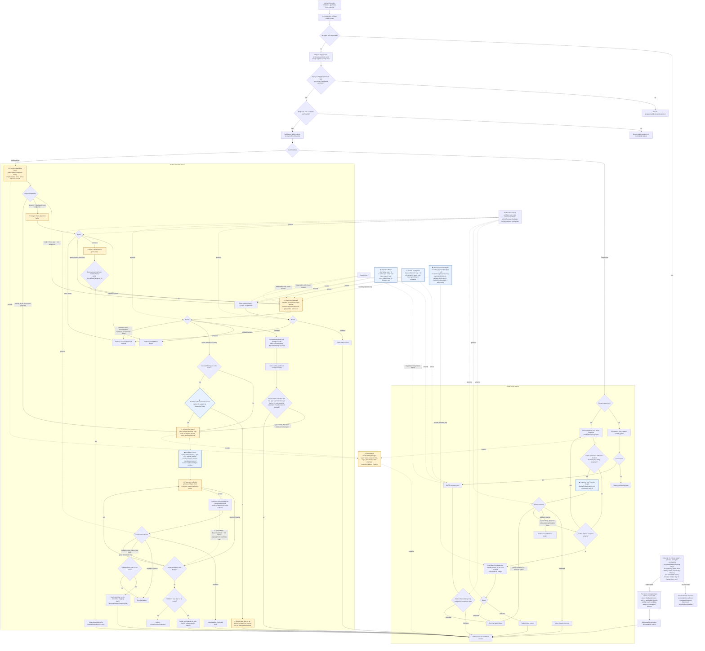

# Planner decision-flow audit

This document maps every retained top-level planning decision to deterministic
fixtures, records why each remaining split is physically necessary, lists the
branches that were removed, and reports the identical-input comparison against
production (`build-core` at `cb7b27d`). Input-validation errors are listed
separately because they never enter route or motion generation.

A discrete route proposal, whether from the initial spatial snapshot, the
arrival snapshot, or the timed visibility graph, does not by itself prove
global earliest arrival. Every accepted motion is accepted only because the
public validator `obstacleAvoidance.validateTrajectory` passes on the complete
returned motion.

## Working principle

The planner is treated as a factory: each stage must emit a truthful input for
the next stage. When a bad result appears, the inputs and decisions are
reproduced by hand at each boundary and the first source of falseness is
removed there. No stage carries a known-bad seed, clock, corridor, or geometry
downstream and then adds filters, retries, fallback profiles, or cleanup stages
to compensate. `SearchKind` summarizes the returned visibility evidence but
never selects polynomial degree, subdivision, solver formulation, or acceptance.

## Current production flow (Mermaid)

This chart is generated from production MATLAB only. Tests, examples, and
sandbox copies are deliberately excluded. `⚠` marks logic added or materially
changed in the current working tree; `◆` marks a threshold or finite budget
that is easy to miss in a top-level read.

There is no route-generation retry schedule. The two fixed-arrival snapshots
are distinct physical guides, and the timed next method is constructed once.
Arrival-Time arrival trials are different requested clocks rather than retries
of one solver state. The ten-step proof loop refines only the proof mesh
for one candidate. All acceptance arrows above pass through the same public
validator; the selected attempt kind reports which physical method won.

### Current earliest-arrival policy check (2026-09-17)

`benchmarkEarliestArrivalPolicy(1)` performs one warmup and one measured run
for each retained method family. All six measured results passed the public
independent validator.

| Case | Runtime (s) | Arrival (s) | Length | Selected source | Attempt path |
| --- | ---: | ---: | ---: | --- | --- |
| Zero-delay departure best plan so far | 1.295 | 4.631128877 | 4.000000000 | `departureSchedule` | analytic accepted; timed timed search attempt superseded |
| Delayed departure retained | 0.399 | 10.140088919 | 10.000000000 | `departureSchedule` | analytic accepted; timed typed miss; best plan so far retained |
| Timed homotopy beats departure | 3.303 | 8.553411322 | 12.463061582 | `timeExpandedVisibilityGraph` | analytic superseded; timed accepted |
| Non-rest arrival-time clock | 0.389 | 5.000000000 | 4.000000000 | `initialSpatialSnapshot` | six clock-local misses; seventh clock accepted |
| Moving-target arrival-time clock | 0.168 | 5.000000000 | 4.609772229 | `initialSpatialSnapshot` | first physical clock accepted |
| Static spatial variable clock | 0.031 | 4.631128877 | 4.123105626 | `initialSpatialSnapshot` | exact spatial guide accepted |

Wall times are indicative single-machine measurements. Arrival, length,
validation, attempt order, selected method, and bounded-search state are the
deterministic comparison fields.

## Public planner routing

| Decision | Representative fixture | Evidence checked | Disposition |
| --- | --- | --- | --- |
| Unsupported continuous obstacle interpolation | `testBoundedCorrespondence/testUnsupportedGeometryReturnsStablePlannerOutcome` | Returns `unsupportedObstacleInterpolation` before search; no convex hull or weakened geometry. `exampleVietnamBoundarySlew` and `exampleMovingDeformingUSOutlineVisibility` left this branch when exact spans and moving cells were added (see `benchmarks/vietnam_boundary.md`) | Required safety boundary |
| Endpoint occupied | `testPlannerDecisionFlow/testInitialEndpointBlocked` | Returns `endpointBlocked` with no motion | Required safety boundary |
| Terminal reachable set contained by an obstacle | `testPlannerDecisionFlow/testTerminalReachabilityBlocked` | Returns `terminalReachabilityBlocked` | Required sufficient infeasibility proof |
| Endpoint derivative or workspace violation | `testEndpointDerivativeLimit`, `testEndpointOutsideWorkspace`, `testWorkspaceBoundaryDerivativeIsRejectedBeforePlanning` | Stable endpoint reason before search | Required physical-input boundary |
| Necessary travel time exceeds fixed horizon | `testPlannerDecisionFlow/testTimeWindowInfeasible` | Returns `timeWindowInfeasible` | Required physical lower bound |
| Wrapped copy resolution | `testWrappedWrapUsesNearestImage`, `testWrappedYAndDualAxisWrap`, `testWrappedYMakesPoleCopies`, `testSphericalTargetKeepsContinuousAzimuthAndFixedGoalCopies`, `testSphericalOrdinaryObstacleCopiesReachAzimuthSeam`, `testPoleCrossingShortensSlew`, `testPoleObstacleBlocksTheCrossing`, `testWrapDirectionLimitsWhichEndMayBeCrossed`, `testWrappedObstacleImageBlocksTheSeam`, `testWrappedFarImageBeatsABlockedNearImage`, `testWrappedMovingTargetIsUnwrappedAcrossTheSeam` | Plain requests in unwrapped coordinates: with y wrapping, all azimuth copies repeat by whole turns even when x cannot cross an end; obstacle copies meet the reachable range, the target is unwrapped by continuity, and the best valid goal copy is accepted by the one gate | Required coordinate policy |
| Wrapped goal has no copy in reach | `testWrappedGoalWithNoReachableCopyReturnsTruthfulFailure` | Returns `timeWindowInfeasible` before search, with an empty candidate list and no invented identity copy | Required physical lower bound |
| Fixed direct chord | `testPlanningCore/testDirect` | Minimum-jerk quintic at the given horizon, public validation | Retained analytic specialization |
| Fixed static detour | `testPlanningCore/testDetourAndTampering`, explicit default detour inputs | Exhaustive exact spatial visibility graph and static BMTP | Retained |
| Fixed dynamic initial-snapshot proof | random case 1 with static obstacle, saved moving detour fixed (`testFixedTimedVisibility/testSavedDetourUsesGivenDeadline`) | The initial exact spatial route proves in the initial BMTP pass or its first refined pass | Retained as first guide |
| Fixed dynamic arrival-snapshot proof | random case 26 with static obstacle, `exampleSpinningUAtStartAndGoal`, `testArrivalSearchRegressions/testArrivalSnapshotFindsAnOpeningMissingAtInitialTime` | A distinct exact route on the arrival-time snapshot is tried only when the initial proof failed and the arrival route differs; identical routes are never solved twice | Retained; second physical guide |
| Fixed dynamic timed guide | `testFixedTimedVisibility/testPersistentSpatialPairsUseTimedSeed` | One time-expanded route on the fixed clock, only after both spatial guides fail to prove | Retained; third physical guide |
| Fixed dynamic initially blocked or disconnected snapshot | `testInitiallyOccupiedFutureGoalUsesTemporalSeed`, `testDisconnectedDynamicSnapshotUsesTemporalSeed` | A temporal direct seed is checked against exact timed cells and public validation | Retained; a static no-route cannot reject a future opening |
| Static no visibility route | `testPlanningCore/testNoPath`, `exampleNoPath` | Exhaustive graph disconnected; `noVisibilityRoute` | Required exact no-route outcome |
| Earliest static rest-to-rest direct | `testEarliestStaticDirectUsesAnalyticClock` | Analytic C3 jerk-limited clock and validation | Retained; fastest exact specialization |
| Earliest static detour | `testStaticActivePairBmtp/testSeparatedSlalomBarriers` | Static active-pair variable-clock BMTP | Retained |
| Earliest zero-delay C3 chord | `testSparseDynamicZeroWaitDeparture` | The retained analytic C3 profile becomes a validated best plan so far. It is objective-terminal only if it attains the necessary arrival lower bound; otherwise the one timed timed search attempt may compete below it | Retained analytic profile with honest proof rule |
| Earliest delayed C3 chord as best plan so far | `testChallengedDelayedChordBestSoFarIsRetained`, `exampleMovingBarrierWait`, `exampleOpeningUShapedObstacle`, `testTimedHomotopyPrecedesDelayedDeparture` | A delayed chord is only an best plan so far; the single timed profile may replace it only with an earlier independently valid motion. If that timed search attempt has a typed method-local miss, the default refinement budget of zero retains the best plan so far and reports the unsearched interval; a caller may explicitly permit bounded arrival-time refinement | Retained and strengthened next method |
| Earliest timed profile beats the best plan so far | `exampleMovingCircleNoWrap`, `testCircleDetourBeatsWaiting`, `testTimedHomotopyPrecedesDelayedDeparture` | The variable-clock timed profile arrives at 8.5732 s for the circle and 8.55 s for the rising-circle regression; both beat their delayed direct chords and validate | Retained |
| Earliest timed profile with a free goal window | `testTimeScopedPlanes/testSavedMovingDetourEarliestArrival`, random case 1 earliest, `testGoalVisibilityWindows/testPublicPlannerChoosesAReopenedGoalWindow`, `testLongRequestUsesBudgetAfterPhysicalBound` | One source-independent variable-clock profile; the goal's clear-wait window bounds the clock; BMTP, not the seed builder, satisfies derivative limits | Retained; the only timed earliest profile |
| Earliest arrival-time search | `testEarliestMovingTargetUsesArrivalTimeClock`, `testEarliestStaticNonrestUsesPhysicalClockTrials` | Moving targets and non-rest endpoints route directly to fixed-arrival trials because the other families do not support their endpoint physics. Dynamic fixed-rest requests enter only after eligible earlier-method misses and, when an best plan so far exists, only within the explicit refinement budget. Each trial is planned on its own clock and accepted against the parent request in the planner's one acceptance gate (`testWrappedNonrestEarliestTrialIsAcceptedOnce`) | Retained; capability-gated incomplete search |
| Earliest arrival-time exhaustion | `testArrivalSearchExhausted` | Stable `arrivalSearchExhausted` with explicit unsearched intervals | Required honest outcome |

## BMTP motion-generation routing

| Motion path | Representative fixture | Why it remains distinct |
| --- | --- | --- |
| Complete polynomial seed | `testCompletePolynomialEdgeAdapterIsLossless` | Preserves an already constructed physical clock and full C3 jet exactly |
| Analytic fixed quintic | fixed direct tests | Avoids optimization when the direct polynomial already proves |
| Analytic earliest C3 chord | static direct and zero-delay departure tests | Computes the physical minimum direct rest-to-rest clock |
| Analytic delayed C3 chord | moving barrier and opening-U tests | Represents a complete stationary wait plus direct motion without resampling |
| Static active-pair alternating BMTP | static detour tests | Duration changes do not alter obstacle-time overlap |
| Fixed-clock all-pair alternating BMTP | fixed static and dynamic tests | Absolute overlap is fixed; a variable-clock solver is unnecessary |
| Variable-clock timed BMTP | moving circle, saved moving detour earliest, static wall, random case 1 earliest | Every duration change alters active obstacle cells and must rebuild overlap |
| Exact proof refinement | polygonal and moving-obstacle tests | Subdivision changes only the proof mesh, never geometry, tolerance, or motion |
| Public independent validation | every success fixture | The only acceptance gate; optimizer status alone never succeeds |

The polynomial representation is selected from the physical request only:
degree 8 for static earliest-arrival guides, degree 5 with three subspans for
everything else, and the seed's own degree for a complete polynomial seed.
The physical clock is declared by the seed's producer as typed
`UsesVariableClock` / `UsesTimeScopedSolver` logicals, never by a timing
label, and one canonical convex decomposition serves every producer and the
independent validator, so no stored label selects geometry.

For a variable-clock timed guide, the motion mesh has
`max(20, originalSegmentCount * request.SplitCount)` spans. The obstacle cell
break count does not set its resolution. `allocateSegmentsByMeasure` starts
with one span per guide edge; `splitByCount` emits each edge's start knot and
the final endpoint. Consequently every timed knot survives, including both
ends of a repeated-position wait, and its duration scales with the common
arrival clock. Every obstacle cell still constrains its exact temporal overlap.
The preceding `fixedArrival` branch retains its existing 8/16-span rule and
never executes this variable-clock expression. This is a numerical mesh change
for earliest-arrival requests, not a pure refactor.

## Branches removed in this consolidation

- Diagnostic seed labels used for degree and subdivision routing in
  `bmtpEngine.pipeline.createSolveRequest`.
- The earliest-arrival fixed-clock manufacture and refinement method sequence; a free
  goal window now uses one variable-clock timed profile.
- The `directVariableClock` challenge of a delayed chord as a separately
  labelled seed; the single timed profile is the timed search attempt.
- The initial-snapshot route length as a global arrival lower bound for moving
  geometry (`InitialRouteTimeBound_s`): later moving geometry can expose a
  shorter route.
- The source-interval count gate that routed sparse histories away from the
  timed profile.
- Stretching an unsolved timed guide to satisfy derivative limits before
  building moving-obstacle planes (`createWarmStart`); the stretch changed
  which obstacle geometry the route encountered. The seed clock is preserved
  exactly for corridor initialization.
- The sampled-only edge oracle for time-invariant obstacles in the temporal
  visibility search; every time-invariant obstacle is now checked exactly, one
  obstacle at a time, over the sub-segment traversed while that obstacle
  exists, using its prepared protected boundary. A thin static wall cannot be
  crossed between samples, and a short-lived static obstacle cannot downgrade
  another wall to sampling (`testFiniteLivedStaticObstacleDoesNotDowngradeAnotherWall`,
  `testPartiallyActiveStaticObstacleIsCheckedOnItsSubInterval`).
- The 13-sample oracle for moving edges. Every retained edge is now checked
  over the complete clock against the exact affine convex time cells. The
  moving half-space residuals are quadratic; all real roots and the intervals
  between them are classified, so a between-sample contact cannot enter BMTP.
- The quadrupling boundary-offset retry schedule, Delaunay-first spatial graph,
  connectivity recovery, and exhaustive next method in timed proposal creation.
  They were compensating for a capped node selector and did not prove any
  motion. One input-scaled staging-node set now feeds one temporal search.
- The near-goal wait preference and later-final-transition tie rule. Temporal
  states now retain the shortest spatial ancestry and first-discovered exact
  tie at each physical layer.
- The seed-label branch in `bmtpEngine.solve`; the delayed-chord family is
  selected from the physical request (direct rest-to-rest earliest request
  with moving cells and no timed guide).
- The fixed-arrival guide method sequence advancing past a solver success that the
  public validator rejected; only solver-level infeasibility admits the next
  guide, and a rejected motion terminates as a defect to diagnose upstream.
  The admitting condition is the typed `candidate.OptimizerIterateUnavailable`
  flag; `TerminationReason` stays explanatory.

## Defects found by hand at stage boundaries

- **Bad clock into BMTP** (moving barrier): the temporal graph supplied a route
  ending at 10.5 s but the warm start stretched it to 48.5 s before planes
  were built. Fixed in `createWarmStart`.
- **Contaminated static edge** (180-second static wall): the 13-sample check
  accepted `[-60,0] -> [1.001,-0.501]` through the wall; exact corridor
  initialization rejected it at segment 8 and arrival-time search then spent
  about 145 s compensating. Fixed with the exact static predicate.
- **Every wait declared blocked** (saved moving detour earliest): the exact
  static predicate returned "not visible" for every zero-length segment, and
  stationary waits are zero-length segments, so any scene with a static
  obstacle lost all waits. The goal window collapsed to one instant, the seed
  clock was forced to equal the horizon, the first variable-clock SOCP was
  infeasible, and the planner fell into the arrival-time method sequence (killed
  after 35 min CPU). Fixed in `checkVisibilitySegments`: a point segment is
  visible exactly when the point is not inside the obstacle. Regression:
  `testArrivalSearchRegressions/testStaticSceneRetainsFreePointWait`.
- **Between-sample corner contact** (`testMixedStaticObstacleLifetimes`): the edge
  `[-2,0] -> [2,2]` passes at distance exactly zero from the protected corner
  `(0.5,1.25)`; thirteen samples never land there. Both the exact static
  predicate and the affine moving-cell predicate reject that same contact, and
  the route enters the goal with positive clearance one layer later.
- **Offset retries masking node selection** (saved moving detour): offsets
  `0.001` through `1.024` produced no timed route, while `4.096` did. The first
  six branches did not help BMTP; they only changed the capped, order-sensitive
  staging nodes. One kinematic offset, bounded by the workspace scale, replaces
  the retry tree.

## Rejected trials (identical inputs, unchanged validator)

| Trial | Result against retained behavior |
| --- | --- |
| Continuous-time safe-interval rewrite of the temporal search (labels over wait components, aligned departures, Pareto time/cost labels) | Static wall arrival improved only from 65.28 s to 65.08 s; moving circle regressed from 8.60 s to the 12.30 s delayed chord because the Pareto-selected sampled proposal cannot initialize an exact corridor; `testMixedStaticObstacleLifetimes` selected later routes. Not adopted; the sampled moving-edge oracle, not the clock, is the limiting representation |
| Degree-8 representation for every time-scoped timed seed (keyed on physical timing mode) | Static wall 64.0018 s (production 64.0) but length 126.64 versus 120.00 (+5.5%); saved moving detour 116.44 s; random case 1 70.07 s. Rejected by the one-sided length gate |
| Layer-midpoint sampling of moving edges | Still missed a true moving-circle contact by about 0.0015 s; denser arbitrary sampling only moves the blind spot |
| Cap `MaxArrivalTrials` at 5 | Premise no longer holds: with the wait fix the static wall completes in about 1.1 s and the method sequence does not recur; the public default is unchanged |
| Initial-snapshot distance as a global arrival bound | Invalid for moving geometry |
| Uniform temporal layers plus one more downstream trial | Cannot repair a missed feasible clock interval |
| Topology rule "start wait plus direct chord" to prove BMTP redundant | BMTP may bend away from the guide; a different speed profile can pass windows a shifted chord cannot |
| Always manufacturing a fixed BMTP motion before free-clock refinement | Saved moving fixture spent 183.4 s and still failed; the single variable-clock profile succeeds in seconds |
| Continuing a fixed-horizon proof to earlier clocks | The old plane set omits pairs that become active at the new clock |

## Identical-input comparison against production (cb7b27d)

Measured on 2026-09-14 on one machine while other MATLAB and agent processes
were running. Wall times are indicative cold runs; arrival and length are
exact. Every candidate success passed `obstacleAvoidance.validateTrajectory`.

### Retained planner families

| Family | Production arrival / length | Candidate arrival / length | dArrival | dLength | Wall prod -> cand (s) |
| --- | ---: | ---: | ---: | ---: | ---: |
| Zero-delay direct C3 | 4.6311288808 / 4 | 4.6311288775 / 4 | 0.000% | 0.000% | 4.34 -> 1.48 |
| Challenged delayed chord retained | 10.8553556404 / 10 | 10.8553556404 / 10 | 0.000% | 0.000% | 13.91 -> 1.08 |
| Moving barrier wait | 10.1400889188 / 10 | 10.1400889188 / 10 | 0.000% | 0.000% | 1.22 -> 0.97 |
| Moving circle detour | 9 / 13.1275346933 | 8.5732124499 / 12.1018884280 | -4.742% | -7.817% | 6.27 -> 2.06 |
| Opening U | 11.6133888606 / 10 | 11.6133888606 / 10 | 0.000% | 0.000% | 1.30 -> 0.85 |
| Saved moving detour earliest | 118.6657606 / 232.72126577 | 118.6665293 / 232.6950111 | +0.001% | -0.011% | 28.9 -> 8.22 |
| Static wall 180 s | 64 / 120.004361257 | 64.6330611095 / 120.005775814 | **+0.989%** | +0.001% | 29.63 -> 3.58 |
| Random case 1 earliest | 71.5 / 134.062872866 | 70.7396341437 / 134.141841873 | -1.064% | +0.059% | 25.77 -> 3.87 |
| Spinning U fixed | 24 / 16.1430599 | 24 / 16.2756944 | 0.000% | +0.822% | n/a -> 20.35 |
| Moving target arrival-time | 5 / 4.6097722286 | 5 / 4.6097722286 | 0.000% | 0.000% | 1.56 -> 0.58 |
| Non-rest endpoint arrival-time | 5 / 4 | 5 / 4 | 0.000% | 0.000% | 1.62 -> 0.65 |
| Arrival search exhausted | `arrivalSearchExhausted` | `arrivalSearchExhausted` | n/a | n/a | 0.11 -> 0.02 |
| Fixed direct | 10 / 4.1231056256 | 10 / 4.1231056256 | 0.000% | 0.000% | 0.10 -> 0.03 |
| Fixed static detour | 12 / 8.5184605652 | 12 / 8.5184605652 | 0.000% | 0.000% | 1.73 -> 0.76 |
| Random case 1 fixed | 180 / 133.118374911 | 180 / 133.118374911 | 0.000% | 0.000% | 1.57 -> 0.55 |
| Saved moving detour fixed | 180 / 231.459647154 | 180 / 231.459647154 | 0.000% | 0.000% | 44.56 -> 7.06 |
| Random case 26 fixed with static obstacle | 180 / 123.060558509 (timed guide) | 180 / 123.841630398 (arrival-snapshot guide) | 0.000% | +0.635% | 21.06 -> 2.00 |
| Static no visibility route | `noVisibilityRoute` | `noVisibilityRoute` | n/a | n/a | 0.57 -> 0.11 |

### Maintained examples (21)

All 21 maintained examples return their documented outcome, including the two
`unsupportedObstacleInterpolation` cases (`exampleVietnamBoundarySlew`,
`exampleMovingDeformingUSOutlineVisibility`). The harness now includes the
previously omitted `exampleSpinningUAtStartAndGoal`. Current notable results:
moving circle 8.5732 s / 12.1019, rotating field 9.1376 s / 20.4273,
spinning U 24 s / 16.2757, 220-vertex moving obstacle 230 s / 121.6385.
One cold run of the 21 cases completed with every row valid; the largest wall
times were 44.73 s for the dense U.S. outline, 35.47 s for the 220-vertex
moving obstacle, and 20.35 s for spinning U. No minute-scale blowup appeared.

Since that audit, `exampleVietnamBoundarySlew` and
`exampleMovingDeformingUSOutlineVisibility` are supported and succeed
(arrival 3000 s / length 113.137085 and arrival 25.8355 s / length
40.5138437, both independently valid). The branch that returns
`unsupportedObstacleInterpolation` is unchanged and still covered by
`testUnsupportedGeometryReturnsStablePlannerOutcome`; the support came from
exact merged keyframe spans and conservative moving cells, as
recorded in `benchmarks/vietnam_boundary.md` and
`obstacle_history_contract.md`.

### Random fixed-arrival corpus (160 requests)

| Measure | Production | Candidate |
| --- | ---: | ---: |
| Valid results | 160 / 160 | 160 / 160 |
| Outcome differences | | 0 |
| Arrival worse than 1% | | 0 |
| Length worse than 1% | | 0 |
| Selected guide changed | | 2 |
| Total planner wall time | 99.793 s | 82.441 s |
| Median request time | 0.462 s | 0.35 s |
| 95th-percentile request time | 1.886 s | below 2 s |
| Maximum request time | 4.583 s | 4.165 s |

### Test suite

Complete deterministic MATLAB suite (`runtests('tests')`): 121 passed, 0
failed, 0 incomplete in 183.5 s. Production's committed reference was 109 to
110 passing tests; the difference is the added consolidation, wait,
sub-interval, and label-invariance regressions.

### Closed static-wall gate

The 180-second static-wall regression now arrives at 64.6330611 s against the
64.0 s exact static reference (+0.989%), with path length +0.001%. The source
fix is a 20-span, source-independent variable-clock mesh; it returns in 3.58 s
instead of production's 29.6 s arrival-time method sequence. The regression asserts
the real 64.64 s gate rather than the former loose 82.5 s threshold.

## Remaining limitations

- Timed proposal nodes still come from a deterministic bounded cover of the
  sampled moving-cell boundary. That cover is proposal-only and does not prune the
  exact affine cell collision checks, BMTP constraints, or independent
  validation. There is one node construction and one temporal search: no
  offset retries, Delaunay graph, connectivity recovery, or next method pair set.
- Temporal arrival layers remain discrete, so a timed proposal does not prove
  global continuous-time earliest arrival. When no analytic lower-bound motion
  applies, the result reports that limitation honestly.
- Boundary policy: the exact segment predicate treats contact with the
  protected boundary as blocked (zero clearance), while the occupancy oracle
  treats boundary points as free. Search nodes are offset from the boundary by
  at least `1e-3` units, so both agree on every node the planner actually
  uses; a direct call with a node exactly on the boundary sees the node free
  but its wait blocked.
- Temporal states live on the layer grid (start, nine uniform times, end,
  obstacle event times and midpoints). The variable-clock BMTP profile absorbs
  most of the snapping; the measured residual is the 2% static-wall gap.
- A retained result is feasible and independently validated, not a proof of
  global earliest arrival over all kinodynamic homotopies.

## Timed mesh audit on azel-mesh (2026-09-15, e422f35)

The candidate removes only obstacle-break-count-driven subdivision in the variable-clock branch. Source inspection verified the allocator/splitter invariant above before editing. No solver, collision predicate, tolerance, margin, or independent validator changed. The warm-start regression uses a real repeated-position edge and checks all guide endpoints and wait duration at 6 s and 9 s clocks. A separate one-cell/920-cell fixture checks identical controls and clocks with the exact guide-derived span count.

### Earliest-arrival returned outcomes

These tables cover the public planner calls with obstacles in the tests and all eleven maintained earliest-arrival obstacle examples. Numbers are rounded for display; comparison used the full recorded values. All successful rows passed the public independent validator. Low-level visibility, warm-start, and solver-only tests do not return the public arrival/length/validity/termination record; their existing assertions also ran. The example benchmark harness and random corpus were not run.

| Example | Arrival before -> after (s) | Length before -> after (units) | Valid before -> after | Termination before -> after |
| --- | ---: | ---: | --- | --- |
| `exampleAlternatingSlalom` | 10.5256093808151 -> 10.5256093808151 | 16.0348697710717 -> 16.0348697710717 | True -> True | `goalReached` -> `goalReached` |
| `exampleDenseConcaveObstacle` | 8.52537658451135 -> 8.52537658451135 | 12.9926384318942 -> 12.9926384318942 | True -> True | `goalReached` -> `goalReached` |
| `exampleMovingBarrierWait` | 10.1400889187796 -> 10.1400889187796 | 10.0000000000012 -> 10.0000000000012 | True -> True | `goalReached` -> `goalReached` |
| `exampleMovingCircleNoWrap` | 8.56951062265595 -> 8.56951062265595 | 12.1019443883314 -> 12.1019443883314 | True -> True | `goalReached` -> `goalReached` |
| `exampleMovingDeformingUSOutlineVisibility` | 25.835524812711 -> 18.5752425863394 | 40.4058494966444 -> 40.3138861637789 | True -> True | `goalReached` -> `goalReached` |
| `exampleMovingRotatingObstacleField` | 9.13832599417378 -> 9.13832599417378 | 20.4272904140566 -> 20.4272904140566 | True -> True | `goalReached` -> `goalReached` |
| `exampleNoPath` | n/a -> n/a | n/a -> n/a | False -> False | `noVisibilityRoute` -> `noVisibilityRoute` |
| `exampleOpeningUShapedObstacle` | 11.6133888606463 -> 11.6133888606463 | 9.9999999999934 -> 9.9999999999934 | True -> True | `goalReached` -> `goalReached` |
| `exampleStaticUShapedObstacle` | 20.8452978469357 -> 20.8452978469357 | 39.3099414805648 -> 39.3099414805648 | True -> True | `goalReached` -> `goalReached` |
| `exampleTwoOpposingUVisibilityGraph` | 21.9462287867139 -> 21.9462287867139 | 24.1447048829346 -> 24.1447048829346 | True -> True | `goalReached` -> `goalReached` |
| `exampleUSOutlineExtremeVisibility` | 6.55513032722789 -> 6.55513032722789 | 21.2120531192916 -> 21.2120531192916 | True -> True | `goalReached` -> `goalReached` |

The moving-circle example also covers `testArrivalSearchRegressions/testCircleDetourBeatsWaiting`; moving barrier covers `testDisconnectedSnapshotRetainsValidatedWaitHonestly` (with `MaxArrivalTrials = 1`); opening U covers `testMovingGeometryDoesNotUseInitialRouteAsGlobalBound`; deforming U.S. covers `testDeformingUSOutline/testReducedOutlineIsSupportedAndValid`. Those test calls were audited separately with the same outcomes.

| Other earliest-arrival planner test | Arrival before -> after (s) | Length before -> after (units) | Valid before -> after | Termination before -> after |
| --- | ---: | ---: | --- | --- |
| `testLongRequestUsesBudgetAfterPhysicalBound` | 64.6330611095465 -> 64.6330611095465 | 120.006647995046 -> 120.006647995046 | True -> True | `goalReached` -> `goalReached` |
| `testArrivalSnapshotFindsAnOpeningMissingAtInitialTime` | 3.74530227425395 -> 3.74530227425395 | 10.2537131532522 -> 10.2537131532522 | True -> True | `goalReached` -> `goalReached` |
| `testArrivalSnapshotFindsRouteAfterWholeCurtainDeparts` | 4 -> 4 | 10.2471788638104 -> 10.2471788638104 | True -> True | `goalReached` -> `goalReached` |
| `testChallengedDelayedChordBestSoFarIsRetained` | 10.8553556404034 -> 10.8553556404034 | 10.0000000000125 -> 10.0000000000125 | True -> True | `goalReached` -> `goalReached` |
| `testTimedHomotopyPrecedesDelayedDeparture` | 8.59818435702582 -> 8.59818435702582 | 12.4581035485593 -> 12.4581035485593 | True -> True | `goalReached` -> `goalReached` |
| `testThinWallCrossingIsNotPromotedBySampling` | 5.51904117006622 -> 5.51904117006622 | 8.06482974577391 -> 8.06482974577391 | True -> True | `goalReached` -> `goalReached` |
| `testPublicPlannerChoosesAReopenedGoalWindow` | 7.99191771264953 -> 7.99191771264953 | 10.0000000000017 -> 10.0000000000017 | True -> True | `goalReached` -> `goalReached` |
| `testWrappedEarliestTrialsRunInsideTheUnwrappedFrame` | 6 -> 6 | 6.98233346438641 -> 6.98233346438641 | True -> True | `goalReached` -> `goalReached` |
| `testSparseDynamicZeroWaitDeparture` | 3.60000000157464 -> 3.60000000157464 | 4.00000000000025 -> 4.00000000000025 | True -> True | `goalReached` -> `goalReached` |
| `testEquivalentSparseAndDenseHistoriesUseProvenDeparture (both source representations)` | 3.60000000157464 -> 3.60000000157464 | 4.00000000000025 -> 4.00000000000025 | True -> True | `goalReached` -> `goalReached` |
| `testConcaveCavityEscape` | 15.9371512418793 -> 15.9371512418793 | 31.201402348745 -> 31.201402348745 | True -> True | `goalReached` -> `goalReached` |
| `testSeparatedSlalomBarriers` | 15.5426409514971 -> 15.5426409514971 | 26.4433503014662 -> 26.4433503014662 | True -> True | `goalReached` -> `goalReached` |
| `testSavedMovingDetourEarliestArrival` | 118.664309567898 -> 118.664309567898 | 232.527473324254 -> 232.527473324254 | True -> True | `goalReached` -> `goalReached` |

The deforming U.S. outline improves by 7.26028222637 s (28.10%) and 0.09196333287 units (0.23%). No measured arrival, length, validity, or termination outcome worsens. Its old two-sided `25.8355` +/- 1% arrival assertion fails on the improvement; that test is outside this brief's ownership and remains unchanged.

### Fixed-arrival code path

`createWarmStart` first takes `if request.Options.GoalTimeMode == "fixedArrival"`; it never enters the following `elseif request.UsesVariableClock` that contains the edited expression. The complete source prefix through the fixed-arrival branch is byte-identical to baseline. All 64 matched fixed-arrival planner calls in the outcome audit retain exactly equal arrival, length, validity, and termination values. Elapsed-time fields were not compared for byte identity.

### Validation and dense-history limitation

- Baseline Stage A: 29 passed, 0 failed; no warm-start analyzer findings. Baseline audit: 152 passes plus three recorder errors (private-helper lookup and the zero-argument defaults call); rerunning those three untouched original tests gave 3 passes. Thus all 155 baseline tests were covered successfully.
- Candidate Stage A: 32 passed, 0 failed, including the wait, cell-count, and updated outline-arrival regressions; no analyzer findings in the touched MATLAB files.
- Candidate Stage B, original files in two bounded groups, excluding the separately capped dense regression: 157 passed, 0 failed, after the outline arrival assertion was updated to the improved value described above. The audit copies independently reproduced 154 passes and that same one failure for the original 155 cases.
- All MATLAB runs used R2024b, this worktree as the current directory, and `tmp/mlpref`. Original assertions were retained. The temporary recorder and copied tests are not production changes.

| Dense t = [915, 1145] s earliest request | Before | After |
| --- | --- | --- |
| Wall time | timeout at 300 s | timeout at 300 s |
| Variable-clock spans / applicable pairs | unavailable: no returned timed guide/motion | unavailable: no returned timed guide/motion |
| Arrival / length / validity / planner termination | unavailable: external timeout, no result | unavailable: external timeout, no result |

The measured timeouts do not establish a dense-history speedup. Other MATLAB work shared the machine, and baseline/candidate audit groups also overlapped; maintained-example wall-time nonregression is not established by those noisy timings. The code change is not claimed to solve the dense request within five minutes.

A separate dense regression was tried and timed out after 300 s, so it was removed rather than shipped. Read-only,
non-stopping conditional breakpoints showed a preliminary **non-variable** warm
start with 1 guide edge, 3 spans, and 38,640 applicable pairs, followed by timed
proposal construction and temporal search. No variable-clock warm start was
emitted before the cap. Those preliminary counts must not be presented as the
requested timed mesh's counts. The remaining observed bottleneck is upstream
of the edited stage, in temporal route search; no search change is in scope.
